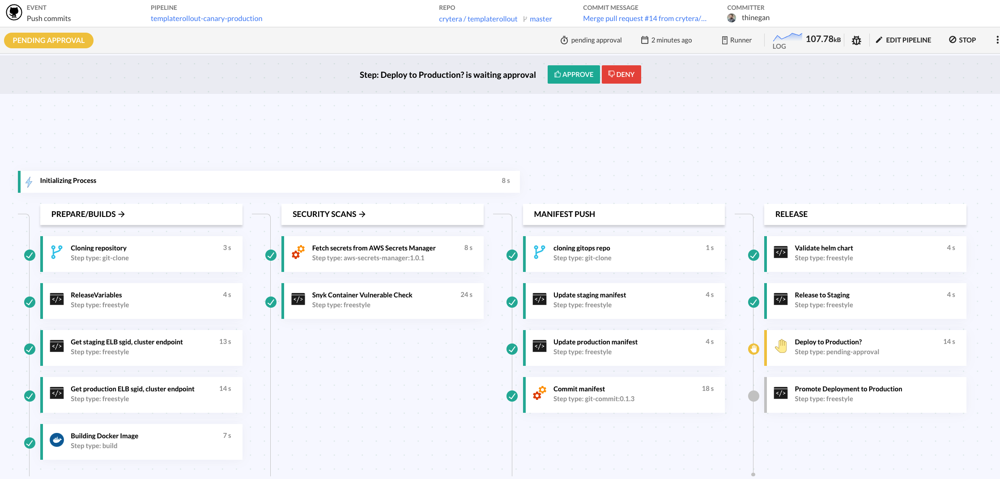
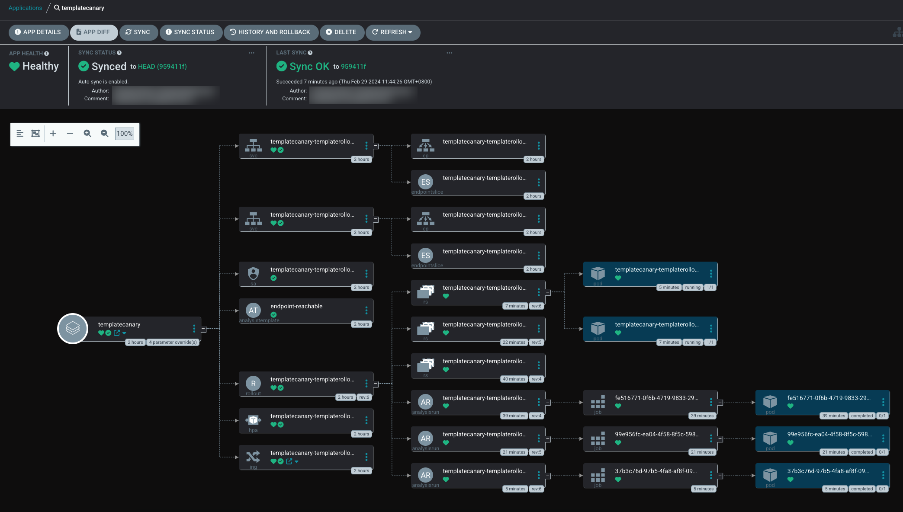

# Docker Build, Security Scan & Deploy CI/CD - templaterollout - Canary

## Sample Project Structures
This project consists of three main folder structures:
cf-pipelines/: Contains CI/CD YAML configuration files and DNS migration settings.
dockers/: Holds the project's codebase.
infra/charts/: Contains Helm chart packages for Kubernetes.

### CI/CD Pipeline
- This section includes YAML configurations for the CI/CD pipeline and DNS migration settings.
- The CI/CD pipeline comprises a series of YAML configurations guiding the process from code pull to building, testing, vulnerability scanning, staging deployment, and production promotion.
- DNS migration files are typically used during service migration from an old cluster to a new one.

### Docker
Docker automates image building by interpreting instructions from a Dockerfile, which contains all commands required to construct a specific image.

### Helm Chart
Helm Chart serves as a package manager for Kubernetes, facilitating the discovery, sharing, and utilization of software designed for Kubernetes environments.

## Benefits for Codefresh CI/CD Platform
- Utilizing Codefresh provides enhanced visibility, easing the debugging process through associated events and workflows, with logs conveniently collected into a central view.
- visit [codefresh](https://codefresh.io/)





## Getting Started
- Begin by cloning your project's codebase using `Git`.
- Build the `Docker` image and upload it to the `AWS ECR` private repository.
- Employ `Synk` security scanner tools to identify vulnerabilities.
- Update the `Gitops` application manifest with the latest image tag, server details, name, and endpoint information.
- Validate the syntax of the `Helm Chart`.
- Release the newly built Docker image to the `staging` cluster.
- Await approval or pending status for promotion to production (with a waiting period of 2 hours or until denied).
- Upon approval, the existing Docker image will be promoted to the `production` cluster.

### Example Rollout Canary strategy
```hcl
strategy:
  canary:
    canaryService: {{ include "templaterollout.fullname" . }}-preview
    stableService: {{ include "templaterollout.fullname" . }}
    trafficRouting:
      alb:
        # The referenced ingress will be injected with a custom action annotation, directing
        # the AWS Load Balancer Controller to split traffic between the canary and stable
        # Service, according to the desired traffic weight (required).
        ingress: {{ include "templaterollout.fullname" . }}
        # Reference to a Service that the Ingress must target in one of the rules (optional).
        # If omitted, uses canary.stableService.
        rootService: {{ include "templaterollout.fullname" . }}
        # Service port is the port which the Service listens on (required).
        servicePort: 80
    steps:
    - setWeight: 10
    - pause: {duration: 1m}
    - analysis:
        templates:
        - templateName: endpoint-reachable
    - setWeight: 40
    - pause: {duration: 10}
```

### What the Sample Project is Doing
- Runs index.html a simple `nginx` web server which returns "Welcome to my BlueGreen webpage hosted in a Docker container" on port 443
- The `Dockerfile` orchestrates the application build process and uploads the Docker image to AWS ECR.

### Prerequisites
- AWS Account Staging and Production
- Codefresh Service
- Cloudflare DNS  Service
- Synk (Security Platform)
- AWS EKS Cluster Staging and Production


## Author
Thinegan Ratnam
 - [https://thinegan.com](https://thinegan.com/)

## Copyright and License
Copyright 2024 Thinegan Ratnam

Code released under the MIT License.
